# ☁️ Cloud Governance Operations Dashboard

[](https://cloud-governance-operations.streamlit.app/)


**Cloud Governance • Python Automation • Data Quality • Risk Management • Executive Reporting**

An enterprise-style portfolio project that uses **Python**, **data-quality rules**, and an executive dashboard to transform a messy cloud-governance pipeline into actionable leadership reporting.

> **Portfolio goal:** Demonstrate how a Business Analyst or Governance professional can use automation to reduce manual reporting, identify cloud risk, and improve operational visibility.

---

## 🚀 Live Demo

Explore the deployed application:

**[Open the Cloud Governance Operations Dashboard](https://cloud-governance-operations.streamlit.app/)**

---

## Overview

Cloud-governance teams often manage intake requests across spreadsheets, ticketing tools, email, and meetings.

Leadership needs clear answers to several operational questions:

- Which cloud use cases are blocked?
- Which requests are aging?
- What evidence is missing?
- Are teams deploying into approved cloud regions?
- Which items need escalation?
- Where is the greatest operational risk?

This project creates a repeatable data-processing and reporting pipeline that answers those questions.

The application converts raw governance records into standardized operational data, applies governance and risk rules, and presents leadership with an exception-focused dashboard.

---

## Business Problem

Manual governance reporting creates several common problems:

1. Analysts spend significant time repeatedly cleaning spreadsheets.
2. Aging calculations may differ between reports.
3. Missing evidence is difficult to track consistently.
4. Region-policy violations can be overlooked.
5. Leadership receives broad status updates instead of an exception-focused view.
6. Governance teams may lack a single, reproducible source of truth.

The solution is a lightweight automation pipeline that standardizes governance data and surfaces the items requiring attention.

---

## Solution

The Cloud Governance Operations Dashboard provides an enterprise-style operational reporting solution capable of:

- Importing raw cloud-governance records
- Cleaning and standardizing governance data
- Calculating request aging
- Identifying missing governance evidence
- Evaluating approved-region compliance
- Assigning Red, Yellow, or Green health status
- Identifying high-risk and critical requests
- Creating a leadership exception queue
- Generating operational KPI summaries
- Providing interactive executive reporting
- Supporting repeatable governance analysis

---

## 🏗️ Cloud Governance Reporting Architecture

The diagram below illustrates the process the application was designed to automate.

It shows how raw governance records move through data validation, business-rule processing, risk analysis, and executive reporting.

```mermaid
flowchart LR

    subgraph DataSources["Governance Data Sources"]
        A["CSV or Excel Export"]
        B["Governance Intake Records"]
        C["Evidence and Risk Data"]
    end

    subgraph PythonPipeline["Python Data Pipeline"]
        D["Import Raw Records"]
        E["Clean and Standardize Data"]
        F["Validate Required Fields"]
        G["Calculate Aging Metrics"]
        H["Evaluate Evidence Status"]
        I["Test Region Compliance"]
        J["Assign RAG Health"]
        K["Create Leadership Exception Queue"]
    end

    subgraph DataOutputs["Processed Governance Outputs"]
        L["Clean Governance Dataset"]
        M["KPI Summary JSON"]
        N["Exception Reporting Dataset"]
    end

    subgraph Reporting["Executive Reporting"]
        O["Streamlit Operations Dashboard"]
        P["Executive KPI Reporting"]
        Q["Risk and Compliance Analysis"]
        R["Operational Detail and Escalations"]
        S["Power BI Model - Planned"]
    end

    A --> D
    B --> D
    C --> D

    D --> E
    E --> F
    F --> G
    G --> H
    H --> I
    I --> J
    J --> K

    K --> L
    K --> M
    K --> N

    L --> O
    M --> O
    N --> O

    O --> P
    O --> Q
    O --> R

    L -. Future Integration .-> S
    M -. Future Integration .-> S

    style A fill:#D6EAF8,stroke:#2E86C1,color:#000000
    style B fill:#D6EAF8,stroke:#2E86C1,color:#000000
    style C fill:#D6EAF8,stroke:#2E86C1,color:#000000

    style D fill:#EBF5FB,stroke:#2E86C1,color:#000000
    style E fill:#EBF5FB,stroke:#2E86C1,color:#000000
    style F fill:#FCF3CF,stroke:#B7950B,color:#000000
    style G fill:#FCF3CF,stroke:#B7950B,color:#000000
    style H fill:#FCF3CF,stroke:#B7950B,color:#000000
    style I fill:#FADBD8,stroke:#CB4335,color:#000000
    style J fill:#E8DAEF,stroke:#7D3C98,color:#000000
    style K fill:#F5B7B1,stroke:#CB4335,color:#000000

    style L fill:#D5F5E3,stroke:#239B56,color:#000000
    style M fill:#D5F5E3,stroke:#239B56,color:#000000
    style N fill:#D5F5E3,stroke:#239B56,color:#000000

    style O fill:#E8DAEF,stroke:#7D3C98,color:#000000
    style P fill:#EBDEF0,stroke:#7D3C98,color:#000000
    style Q fill:#EBDEF0,stroke:#7D3C98,color:#000000
    style R fill:#EBDEF0,stroke:#7D3C98,color:#000000
    style S fill:#EAECEE,stroke:#626567,color:#000000
```



### Architecture Logic

1. Raw governance data is collected from CSV or Excel exports.
2. The Python pipeline imports and standardizes the source records.
3. Required fields and identifiers are validated.
4. Aging metrics are calculated consistently.
5. Missing evidence and documentation are identified.
6. Actual cloud regions are evaluated against approved-region policy.
7. Governance rules assign Red, Yellow, or Green health status.
8. High-risk, aging, and noncompliant records are added to a leadership exception queue.
9. The pipeline exports a clean dataset, KPI summary, and exception-reporting data.
10. Streamlit presents the results through executive, risk, compliance, and operational views.
11. The processed outputs can support a future Power BI reporting model.

---

## Project Structure

```text
cloud-governance-operations-dashboard/
│
├── dashboard/
│   └── app.py
│
├── data/
│   ├── raw/
│   │   └── cloud_governance_pipeline_raw.csv
│   │
│   └── processed/
│       ├── cloud_governance_pipeline_clean.csv
│       └── kpi_summary.json
│
├── docs/
│   └── screenshots/
│       ├── executive-overview.png
│       ├── risk-compliance.png
│       └── exception-queue.png
│
├── src/
│   └── pipeline.py
│
├── tests/
│   └── test_pipeline.py
│
├── .gitignore
├── LICENSE
├── README.md
└── requirements.txt
```

---

## Python Automation

The script in `src/pipeline.py`:

1. Imports the raw governance pipeline.
2. Cleans whitespace, capitalization, dates, and identifiers.
3. Removes duplicate or invalid records.
4. Calculates the number of days each item has been open.
5. Flags missing documentation.
6. Checks whether the actual cloud region is approved.
7. Assigns **Red**, **Yellow**, or **Green** health.
8. Creates a leadership exception queue.
9. Exports a clean CSV and KPI summary.

---

## RAG Health Logic

The application uses simplified governance rules to assign operational health.

| Status | Example rule |
|---|---|
| **Red** | Unapproved region, critical risk, or more than 90 days old |
| **Yellow** | Missing evidence, high risk, or more than 45 days old |
| **Green** | Approved or progressing within expected thresholds |

A record cannot receive a Green health status when it contains a critical risk or an unapproved-region exception.

These rules are simplified for demonstration and can be replaced with organization-specific governance policies, risk thresholds, and service-level agreements.

---

## Dashboard Features

### Executive Overview

Provides leadership with a high-level view of governance operations, including:

- Total cloud use cases
- Red and Yellow items
- Average request aging
- Missing governance evidence
- Region-compliance exceptions
- Pipeline distribution by stage
- Risk-level distribution
- Governance readiness

### Governance Pipeline

Tracks cloud use cases as they progress through governance stages.

Users can review:

- Current governance stage
- Submission date
- Days in stage
- Assigned owner
- Cloud provider
- Risk level
- Health status
- Evidence status
- Region-compliance status

### Interactive Filtering

The dashboard supports filtering by:

- Cloud Provider
- Owner
- Governance Stage
- Health Status
- Risk Level
- Evidence Status
- Region Compliance

### Risk and Compliance Analysis

Highlights:

- Critical and high-risk requests
- Approved versus unapproved regions
- Missing evidence
- Long-aging requests
- Provider-level risk
- Governance control exceptions

### Leadership Exception Queue

Surfaces requests requiring leadership or governance attention, including:

- Red-health items
- Critical-risk items
- Unapproved cloud regions
- Missing evidence
- Requests exceeding aging thresholds
- Items requiring escalation

### Operational Detail

Provides a searchable, filterable view of individual governance records for follow-up and investigation.

---

## Running the Project

### 1. Create a virtual environment

```bash
python -m venv .venv
```

Activate the virtual environment.

#### macOS or Linux

```bash
source .venv/bin/activate
```

#### Windows PowerShell

```powershell
.venv\Scripts\Activate.ps1
```

### 2. Install dependencies

```bash
pip install -r requirements.txt
```

### 3. Run the data pipeline

```bash
python src/pipeline.py
```

This creates:

```text
data/processed/cloud_governance_pipeline_clean.csv
data/processed/kpi_summary.json
```

### 4. Launch the dashboard

```bash
streamlit run dashboard/app.py
```

---

## 📸 Application Walkthrough

### Executive Overview


---

### Risk and Compliance


---

### Leadership Exception Queue


---

## Power BI Dashboard

The planned Power BI report will use the processed CSV and KPI outputs.

It may include:

- Executive KPI cards
- Pipeline volume by stage
- RAG health distribution
- Aging buckets
- Region-compliance exceptions
- Missing-evidence analysis
- Risk by cloud provider
- Owner workload
- Leadership escalation queue

### Recommended Power BI Pages

#### Page 1 — Executive Overview

- Total use cases
- Red and Yellow items
- Average aging
- Missing evidence
- Region exceptions
- Pipeline by stage

#### Page 2 — Risk and Compliance

- Risk level by provider
- Approved versus unapproved regions
- Critical and high-risk items
- Evidence gaps

#### Page 3 — Operational Detail

- Searchable use-case table
- Owner and stage filters
- Aging buckets
- Escalation status

---

## Future Improvements

- Read directly from Excel, SharePoint, Jira, or ServiceNow
- Send weekly exception summaries by email or Microsoft Teams
- Add SLA rules by governance stage
- Add automated data-quality tests
- Add an AI-generated executive summary
- Connect to Azure Resource Graph, AWS Config, or Google Cloud Asset Inventory
- Validate live cloud resources against approved-region policy
- Provision the dashboard environment with Terraform
- Add CI/CD with GitHub Actions
- Containerize the application with Docker
- Add role-based access control
- Add historical risk trending
- Add an enterprise SQL backend
- Add downloadable audit and governance reports

---

## Lessons Learned

Key lessons demonstrated by this project include:

- Governance rules must be translated into explicit, testable logic.
- Data cleaning is often the largest part of reporting automation.
- Leadership dashboards should prioritize exceptions rather than raw activity.
- Governance metrics must be calculated consistently to support reliable decision-making.
- Risk and compliance reporting is more useful when connected to ownership and required action.
- Technical solutions create greater value when tied to a measurable business problem.
- Documentation makes automation maintainable and transferable.
- Executive reporting should communicate what requires attention, why it matters, and who owns the next action.

---

## Skills Demonstrated

### Programming and Automation

- Python
- Pandas
- JSON
- Data transformation
- Data validation
- Automation
- Business-rule development

### Governance and Risk

- Cloud governance
- Risk and compliance reporting
- Evidence validation
- Region-policy compliance
- Operational risk identification
- Governance workflow analysis
- Leadership exception reporting

### Business Analysis

- Business requirements analysis
- Process improvement
- KPI development
- Workflow design
- Technical and business translation
- Executive reporting
- Operational problem-solving

### Reporting and Development

- Streamlit
- Power BI planning
- Git
- GitHub
- Dashboard design
- Data visualization
- Application documentation

---

## Responsible Use

This repository uses entirely synthetic data.

It does not contain:

- Confidential employer information
- Internal governance policies
- Real employee names
- Real cloud-service requests
- Proprietary architecture decisions
- Employer-specific workflows
- Production cloud data

The project is intended solely for educational and portfolio demonstration purposes.

---

## License

This project is licensed under the **MIT License**.

See the `LICENSE` file for additional information.

---

## Author

**Kareem Watts**

Technical Business Analyst  
Cloud Governance  
Cybersecurity Governance  
Python Automation  
Executive Reporting  

**Live Application:** [cloud-governance-operations.streamlit.app](https://cloud-governance-operations.streamlit.app/)

**GitHub Portfolio:** [github.com/reemdadreem](https://github.com/reemdadreem)
